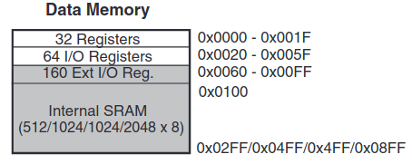

# ATMEGA328P HAL

Bare metal programming Atmega328P

## How to configure a pin as input or output?

First we will look a simple example of setting a specific pin as output, then diving deeper into theory.

### Direction mode for pin

Quote from datasheet section “14.2.1 Configuring the Pin”

> “The DDxn bit in the DDRx Register selects the direction of this  
> pin. If DDxn is written logic one, Pxn is configured as an output  
> pin. If DDxn is written logic zero, Pxn is configured as an input pin.”

Set the 3rd pin on the GPIOB port to 1 (setting it as output):

```c
// bitwise "OR" everything in the port with 0
// except for pin 3, here do "OR" with 1 
DDRB |= (1 << 3);
```

---

## What is a pin defined as and how does it refer to memory?

Let’s look at how we can reference a location for initializing a pin as input or output.

From section “14.4.3 DDRB – The Port B Data Direction Register” in the datasheet:

Going top-down from macro definition of a pin to memory location is as follows:

```c
#define PINB  _SFR_IO8(0x03)
#define DDRB  _SFR_IO8(0x04)
#define PORTB _SFR_IO8(0x05)
```

See anything in common? The `SFR_IO8()` is a macro that serves as an abstraction that calls another macro:

```c
#define _SFR_IO8(io_addr) _MMIO_BYTE((io_addr) + __SFR_OFFSET)
#define __SFR_OFFSET 0x20
```

Lastly, the final macro:

```c
#define _MMIO_BYTE(mem_addr) (*(volatile uint8_t *)(mem_addr))
```

Without all the abstractions DDRB would simply be defined as:

```c
#define DDRB (*(volatile uint8_t *)(0x24))
```

In words this reads: “treat DDRB as an 8-bit unsigned integer located at 0x24 in memory”.

The initial `(volatile uint8_t *)` creates the pointer to the address, where a byte is stored. `volatile` makes sure the compiler does not optimize it to a constant, and read/write gets handled correctly.

Then `*()` dereferences the pointer so that DDRB can be used like a variable, which will be showcased later in this post.

### Why offset 0x20?

It comes down to how data memory is stored on the microcontroller. From section “8-3. Data Memory Map” in the datasheet:



Here the 32 general purpose registers refer to the CPU registers for logic/arithmetic instructions. For example when writing assembly, code like `load immediate r0, 1` → uses CPU registers. To avoid messing with these registers an offset of 0x20 is passed, here is the beginning of the I/O ports.

---

## Application — from IO to HAL

### Current code for rotary encoder that uses I/O mapped directly

```c
#include "avr/io.h"             // include the IO definitions for the defined microcontroller

#define LED_G   PORTB3
#define LED_Y   PORTB2
#define CLK     PORTB5
#define DT      PORTB4
#define SW      PORTB0

int main(void){
    // init output pins 3–2 (pins are input by default)
    DDRB |= (1 << LED_G) | (1 << LED_Y);

    unsigned pinALast = PINB & (1 << CLK);      // read initial value for cmp
    unsigned aVal;
    int8_t bCW = -1;

    while(1){
        aVal = PINB & (1 << CLK);             // read new CLK
        if (aVal != pinALast && aVal == 0) {  // change in state occurred (falling edge)
            if ((PINB & (1 << DT)) != aVal)   // ..CLK changed first 
                bCW = 1;                      // ....clockwise!
            else {                            // ..DT changed first
                bCW = 0;                      // ....Counter-Clockwise!
            }

            if (bCW == 1) {                   // CW...
                PORTB |= (1 << LED_G);        // ...turn green LED ON
                PORTB &= ~(1 << LED_Y);       // ...and yellow off!!
            } 
            else if (bCW == 0) {              // CCW...
                PORTB |= (1 << LED_Y);        // ...turn yellow LED ON
                PORTB &= ~(1 << LED_G);       // ...and green off!!
            }
        }

        if ((PINB & (1 << SW)) == 0) {        // switch pushed, both LEDs on 
            do {                              // keep on while pushed
                PORTB |= (1 << LED_G) | (1 << LED_Y);
            } while ((PINB & (1 << SW)) == 0);
            PORTB = 0x00;                     // reset LEDs after SW open again
        }

        bCW = -1;
        pinALast = aVal;
    }
}
```

Although this is not a very complex example, for someone just skimming through the code it’s not always obvious what is going on. This leads to excessive comments as well.

Looking at the lines relevant for DDRB we see how in bare-metal programming we define the direction. We can create a function to abstract this a bit. Note that in the example below an Enum is created for GPIO modes, such as input, output as well as activating pull-up resistors.

```c
void gpio_init(volatile uint8_t *ddr, gpio_mode_t dir, uint8_t pin, gpio_state_t pu) {
    if (dir == GPIO_MODE_OUT){
        *ddr |= (1 << pin);
        return;
    }
    if (dir != GPIO_MODE_IN) return;

    *ddr &= ~(1 << pin);

    uint8_t state = pu;
    if (state == GPIO_PULLUP_OFF) return;

    // write logic one to PORTxn for pin configured as input pin to setup pull-up
    if (*ddr == DDRB){
        PORTB |= (1 << pin);
    }
    else if (*ddr == DDRC){
        PORTC |= (1 << pin);
    }
    else if (*ddr == DDRD){
        PORTD |= (1 << pin);
    }
}
```

Now we have some simple code that initializes the pins. Reading and writing is really just a handful of lines of code so it may seem like a useless step, but the benefit is abstraction, portability and debugging.

```c
uint8_t gpio_read(volatile uint8_t *port, uint8_t pin){
    return ( (*port) & (1 << pin) ) != 0;
}

void gpio_write(volatile uint8_t *port, uint8_t pin, uint8_t val){
    if (val){
        (*port) |= (1 << pin);
    } else {
        (*port) &= ~(1 << pin);
    }
}
```

Using this we get much cleaner and readable code:

```c
#include "GPIO.h"

#define LED_G   PORTB3
#define LED_Y   PORTB2
#define CLK     PORTB5
#define DT      PORTB4
#define SW      PORTB0

int main(void){
    // init output pins 3–2 (pins are input by default)
    gpio_init_multi_pin(&DDRB, GPIO_MODE_OUT, GPIO_PULLUP_OFF, 2, LED_G, LED_Y);
    gpio_init(&DDRB, GPIO_MODE_IN, SW, GPIO_PULLUP_ON);

    uint8_t pinALast = gpio_read(&PINB, CLK);
    uint8_t aVal;
    int8_t bCW = -1;

    while(1){
        aVal = gpio_read(&PINB, CLK);             // read new CLK
        if (aVal != pinALast && aVal == 0){       // change in state occurred (falling edge)
            if (gpio_read(&PINB, DT) != aVal)     // ..CLK changed first 
                bCW = 1;                          // ....clockwise!
            else {                                // ..DT changed first
                bCW = 0;                          // ....Counter-Clockwise!
            }

            if (bCW == 1){                        // CW...
                gpio_write(&PORTB, LED_G, 1);
                gpio_write(&PORTB, LED_Y, 0);
            } 
            else if (bCW == 0){                   // CCW...
                gpio_write(&PORTB, LED_Y, 1);
                gpio_write(&PORTB, LED_G, 0);
            }
        }

        if (gpio_read(&PINB, SW) == 0){           // switch pushed, both LEDs on 
            do {
                PORTB |= (1 << LED_G) | (1 << LED_Y);
            } while (gpio_read(&PINB, SW) == 0);
            PORTB = 0x00;                         // reset LEDs after SW open again
        }

        bCW = -1;
        pinALast = aVal;
    }
}
```

---

## Variadic Multi-Pin Init Function

Notice the function `gpio_init_multi_pin()`. It is a variadic function, meaning the parameters are dynamic. This makes it a bit easier to define multiple pins with one function. Here’s a look at how this can be implemented, but really it is simply looping through all extra parameters and calling the same function.

```c
void gpio_init_multi_pin(volatile uint8_t *ddr, gpio_mode_t dir, gpio_state_t pu_state, uint8_t pin_count, ...) {
    va_list args;
    va_start(args, pin_count);

    for (uint8_t i=0; i<pin_count; i++){
        uint8_t pin = va_arg(args, int);
        gpio_init(ddr, dir, pin, pu_state);
    }
    va_end(args);
}
```

## References
Datasheet for [Atmega328p](https://ww1.microchip.com/downloads/en/DeviceDoc/ATmega48A-PA-88A-PA-168A-PA-328-P-DS-DS40002061A.pdf)

GNU GCC refrence for [Varadic Functions](https://www.gnu.org/software/libc/manual/html_node/Variadic-Functions.html)
